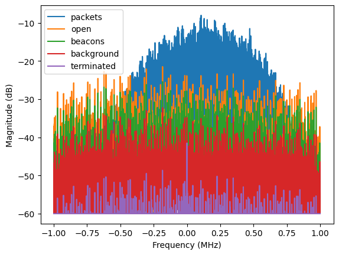
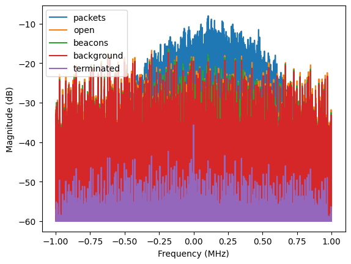

#  Capturing and Extracting Features
The code in these notebooks allows for the capture and labelling of RF data as well as the extraction of features that can later be used for classification.
Some more supporting code used is located in the [src](../src) folder.
The [ble-rff-env](../ble-rff-env/) folder contains a python environment with the modules required to run the notebooks.

The Notebooks are designed to be ran on a Raspberry Pi with the use of a PLUTO SDR as well as a WD Elements hard disk, both connected to the Pi via USB.
[install.sh](../install.sh) mounts the disk to the [disk](../disk) folder for easy access by the python programs.
The PLUTO SDR does not need to be mounted.

The best way to connect to the Raspberry Pi is to use the [Remote - SSH](https://marketplace.visualstudio.com/items?itemName=ms-vscode-remote.remote-ssh) extension for Visual Studio Code.
Thi Pi is available with the host name 10.84.2.50.
This is much lighter and faster than using full desktop remote access with tools like RealVNC.

## 1. Overview
The process is done in three steps:
1. Data capture
2. Preprocessing of data
3. Feature extraction

### 1.1. Data Capture
The data capture is done by logging BLE advertisements received by the Raspberry Pi's built-in Bluetooth module while simultaneously sampling using a PLUTO SDR.
The advertisements as well as the samples recorded are timestamped, so that they could later be matched.
As the code now actually decodes the BLE advertisements to extract the device addresses, the Pi's BLE log is no longer strictly needed.

#### Asynchronous Code:
Concurrent code was used to spread and reduce the load on the Raspberry Pi.

Running the asynchronous capture spawns a process that reads data from the SDR as soon as its ready.
This process creates new processes that save the data to disk.
These save processes are left to run until they finish, when their reference is deleted by the process that started them.

The logging of the BLE advertisements captured by the Raspberry Pi is done in the main loop using BlueZ, which allows for the registration of a callback that is called once an advertisement is detected.

### 1.2. Preprocessing of Data
The saved SDR data bursts are decoded and the data stored in an array.
Decoding takes place in the following steps:
1. Transmissions are detected using a simple threshold, yielding a list of the beginnings and ends of all transmissions.
2. All values not belonging to a transmissions are ignored.
3. CFO compensation is done by subtracting a linspace from the angle that has the same start and end values as the signal.
4. The angle of the IQ data is differentiated and decoded by simply checking if the derivative is possible or negative.
5. Convolving the preamble with the signal yields the start points of the data.
6. The data is split up into its distinct parts and stored in a convenient data structure.

The data recorded by the SDR can then be split up, saved, and labelled using the decoded device address.

### 1.3. Feature Extraction
The last step is to calculate different characteristics of the labelled data that can then be used to train a model to differentiate devices.

## 2. BLE Beacons
The SparkFun NanoBeacon IN100 can be used to generate sample advertisements to capture reference data.
They can be configured to advertise with a given time interval using the [NanoBeacon Config Tool](https://inplay-tech.com/nanobeacon-config-tool).

Some sample configs are saved under [S:\HTU\A1874_ISE\A1874_Projekte\2025_PRISM6G_Hasler\BT-Beacons\Configs](S:\HTU\A1874_ISE\A1874_Projekte\2025_PRISM6G_Hasler\BT-Beacons\Configs).

### 2.1. Adapter
A USB to serial adapter is required to communicate with the beacons.
As the available TTL-232R-3V3 converter outputs a 5V supply voltage despite 3.3V logic signals, a small PCB featuring a linear voltage regulator was created to step down the supply voltage.
All other signals are passed straight through.

### 2.2. Nano Beacon Configurations
A collection of Configurations have been burned onto the NanoBeacons for easy testing.
To tell them apart they have been labelled with their complete local name.

They are configured to transmit an advertisement in a given interval using their local name according to the following table:

| Name | Interval  | Address           |
|------|-----------|-------------------|
|    0 | 10'000 ms | F2:1F:3E:4D:CD:74 |
|    1 | 10'000 ms | FF:23:E1:B4:67:8A |
|    2 | 10'000 ms | C3:50:AF:89:C0:1A |
|    3 | 10'000 ms | EC:E3:AA:19:43:37 |
|    4 | 10'000 ms | EB:9F:8B:E5:AC:76 |
|    5 | 10'000 ms | F9:35:CF:DF:78:AC |
|    6 | 10'000 ms | D2:2C:0A:5F:FE:95 |
|    7 | 10'000 ms | F0:CF:0A:47:55:AF |
|    8 | 10'000 ms | DA:21:CA:C5:42:99 |
|    9 | 10'000 ms | CC:45:51:48:DA:29 |
|    a |  1'000 ms | CA:21:C7:1B:ED:FE |
|    b |  1'000 ms | D2:C1:89:A4:11:13 |
|    c |  1'000 ms | CD:C6:53:1F:73:E0 |
|    d |  1'000 ms | EC:8B:1B:7A:D5:C5 |
|    e |  1'000 ms | D0:22:2B:0F:58:F6 |
|    f |  1'000 ms | D9:48:77:9E:AD:39 |
|    g |  1'000 ms | C8:38:D4:89:79:BF |
|    h |  1'000 ms | C8:03:74:BD:EE:2D |
|    i |  1'000 ms | E7:15:25:E4:1C:74 |
|    p |  1'000 ms | FB:42:CF:CF:61:22 |
|    A |    100 ms | C3:F7:41:BF:6E:50 |
|    B |    100 ms | E6:80:E5:3B:0A:76 |
|    C |    100 ms | C3:CB:37:1B:E9:69 |
|    D |    100 ms | FE:14:5C:74:FC:AA |
|    E |    100 ms | D2:48:54:2C:BB:D4 |

The beacons transmit the following data:

| Value     |Description                                                    |
|-----------|---------------------------------------------------------------|
| 0xaa      | Preamble                                                      |
| 0xd6      | Access Address: 0x8e89bed6                                    |
| 0xbe      | "                                                             |
| 0x89      | "                                                             |
| 0x8e      | "                                                             |
| 0x42      | Device Info and Advert PDU Type [[1]](#device-info-and-type)  |
| 0x25      | Data Length (37 Bytes)                                        |
| LSB       | Device Address                                                |
| .         | "                                                             |
| .         | "                                                             |
| .         | "                                                             |
| .         | "                                                             |
| MSB       | "                                                             |
| *         | Whitened Data Configured in Config Tool                       |

[1]: Device info is 4: RFU=0, ChSel=0, TxAdd=1 (random address), RxAdd=0 and the advertising PDU type is 2: ADV_NONCONN_­IND. Details are described in [vol. 6 part B section 2.3 of the bluetooth specification](https://www.bluetooth.com/wp-content/uploads/Files/Specification/HTML/Core-54/out/en/low-energy-controller/link-layer-specification.html#:~:text=2.3.%20Advertising%20physical%20channel%20PDU).

The custom data configured in the NanoBeaconConfigTool is constructed as follows and whitened as described in [vol. 6 part B section 3.2 of the bluetooth specification](https://www.bluetooth.com/wp-content/uploads/Files/Specification/HTML/Core-54/out/en/low-energy-controller/link-layer-specification.html#:~:text=3.2.%20Data%20whitening) before transmission:

|Byte| Value     |Description                        |
|----|-----------|-----------------------------------|
|  0 | 0x02      | Data Length (2 Bytes)             |
|  1 | 0x09      | Data Type (Complete Local Name)   |
|  2 | name      | Name as Listed Above              |
|  3 | 0x03      | Data Length (3 Bytes)             |
|  4 | 0x03      | Data Type (List of service UUIDs) |
|  5 | 0x1C      | Service ID: 0x181C (User Data)    |
|  6 | 0x18      | "                                 |
|  7 | 0x16      | Data Length (19 Bytes)            |
|  8 | 0x16      | Data Type (Service Data)          |
|  9 | 0x1C      | Service ID: 0x181C (User Data)    |
| 10 | 0x18      | "                                 |
| 11 | random    | Random Data                       |
| 12 | random    |                                   |
| 13 | random    |                                   |
| 14 | random    |                                   |
| 15 | random    |                                   |
| 16 | random    |                                   |
| 17 | random    |                                   |
| 18 | random    |                                   |
| 19 | random    |                                   |
| 20 | random    |                                   |
| 21 | random    |                                   |
| 22 | random    |                                   |
| 23 | random    |                                   |
| 24 | random    |                                   |
| 25 | random    |                                   |
| 26 | random    |                                   |
| 27 | random    |                                   |
| 28 | random    |                                   |
| 29 | random    |                                   |
| 30 | random    |                                   |

### 2.3. Hardware Setup
The BLE beacons can be supplied by a voltage between 1 and 3.6 volts as per [their data sheet](https://cdn.sparkfun.com/assets/3/d/5/5/1/IN100-Datasheet.pdf).
This allows them to be supplied by the Raspberry Pi's 3.3 V rail.
The beacons are plugged into a breadboard with one breadboard per advertisement interval in order to make switching between different periods easy.
The supplies of all beacons can then be connected to the Pi's IO header using a single connection.

## 3. Anechoic Chamber
Finding the advertisements transmitted by the Beacons in the SDR samples was nearly impossible as a large number of devices in the office advertise with a high frequency.
For this reason the Arduino including the storage disk used to store the SDR samples as well as the SDR were put into the antenna test chamber of the institute for automation.
The power supply and an ethernet cable were simply looped through the opening in the chamber.

The notebook [00_evaluate_spectra.ipynb](00_evaluate_spectra.ipynb) was used to record and plot the spectrum received by the SDR in different setups.
The results are shown in the following figures stored under [illustrations](./illustrations/):

Ten bursts per trace, averaged:

Ten bursts per trace, maximum filter:

| Trace Name | Setup                                                                              |
|------------|------------------------------------------------------------------------------------|
| open       | Chamber door open, no beacons transmitting                                         |
| background | Chamber closed, beacons not transmitting                                           |
| beacons    | Chamber closed, beacons transmitting                                               |
| packets    | Like "beacons" but only the samples where the beacons were transmitting were used. |
| terminated | Chamber closed, SDR RX input terminated                                            |

The TX output of the PLUTO SDR was also terminated to minimize interference, making sure it would not transmit any unwanted signals.

The measurements were taken with automatic gain control enabled.
This results in similar noise levels for all setups when using the maximum filter.
Ideally, this measurement should be repeated with a fixed SDR gain.
It is however also apparent that the chamber is providing adequate isolation by the fact that almost no packets from devices other than the beacons are registered when running a measurement.